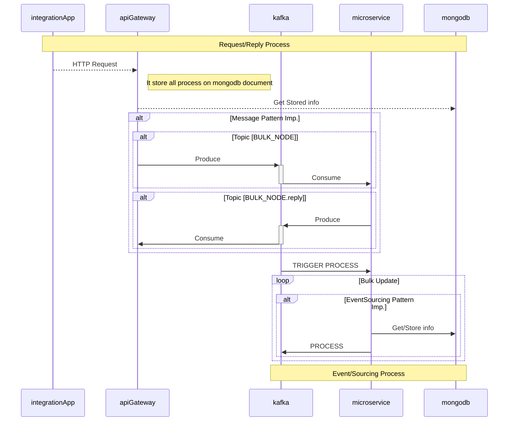

# Multivende - Implementation Test :rocket:

# Diagrama de Arquitectura

```mermaid
sequenceDiagram
    participant integrationApp
    participant apiGateway
    participant kafka
    participant microservice
    participant mongodb

    Note over integrationApp,mongodb: Request/Reply Process

    integrationApp-->>apiGateway: HTTP Request

    Note right of apiGateway: It store all process on mongodb document
        apiGateway-->>mongodb: Get Stored info

    alt Message Pattern Imp.
        alt Topic [BULK_NODE]
            apiGateway->>+kafka: Produce
            kafka->>-microservice: Consume
        end

        alt Topic [BULK_NODE.reply]
            microservice->>+kafka: Produce
            kafka->>-apiGateway: Consume
        end
    end

    kafka->>microservice: TRIGGER PROCESS

    loop Bulk Update
        alt EventSourcing Pattern Imp.
            microservice->>mongodb: Get/Store info
            microservice->>kafka: PROCESS
        end
    end

    Note over kafka,mongodb: Event/Sourcing Process
```
