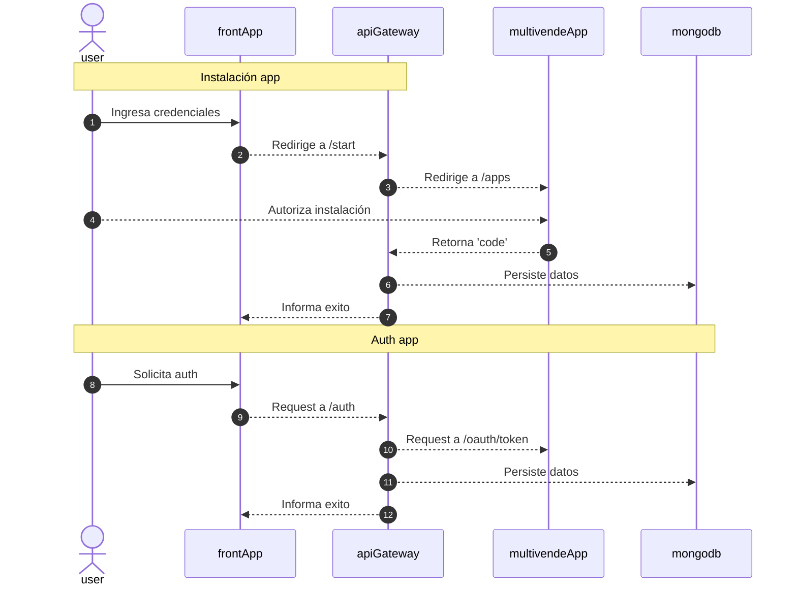
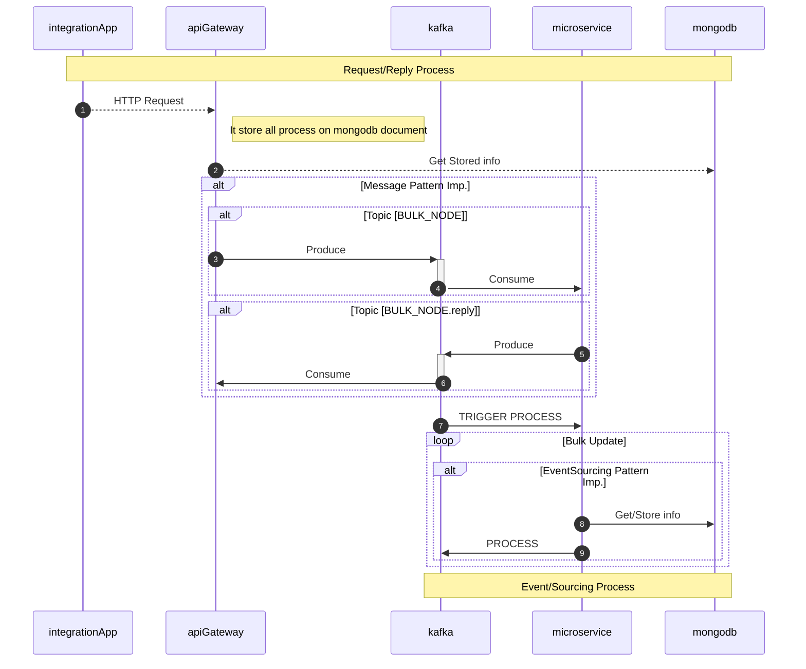

# Multivende - Implementation Test :rocket:

- [Descripción](#Descripción)
- [Instalación](#Instalación)
- [Diagrama de Instación de App](#Diagrama_de_Instalación_de_App)
- [Diagrama de Arquitectura](#Diagrama_de_Arquitectura)

# Descripción

La solución permite conectarnos a los servicos API de multivende mediante un app
que debe ser instalada en la cuenta del usuario.
La solución incluye.

- MongoDb: Base de datos.
- NestJS (Backend): Funciona como backend y apiGateway entre internet y los microservicios
- NestJS (Microservice): Microservicio que implementa una conexión Kafka para la comunicación
- ReactApp (Frontend): Web App para la interación con el backend.
- confluentinc/cp-kafka: Kafka server.
- provectuslabs/kafka-ui: Web app para administración y GUI de kafka.

# Instalación

- [Instalación en local](./docs/local-deploy.md)!
- [Despliegue con Docker](./docs/docker.md)!
- [Capturas](./docs/software-description.md)!

# Diagrama de Instalación de App

Instalación de la app en la plataforma de multivende:

- Primero se ingresa las credenciales del app.
- Se debe autorizar el app mediante la plataforma multivende.
- Esto genera un code que luego se ocupará para generar un token de autenticación.

# Diagrama de Arquitectura

El software incluye una implementación de un apiGateway (backend) que se comunica con el microservicio mediante TRANSPORT.KAFKA.

